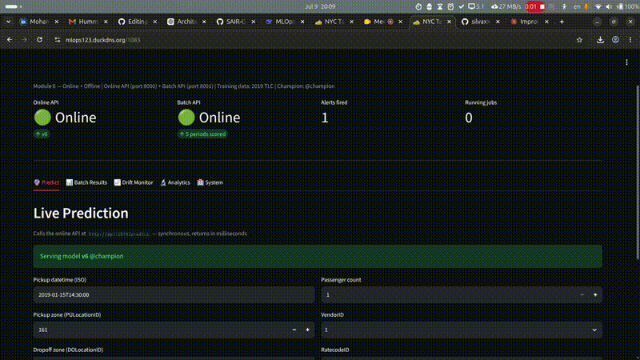
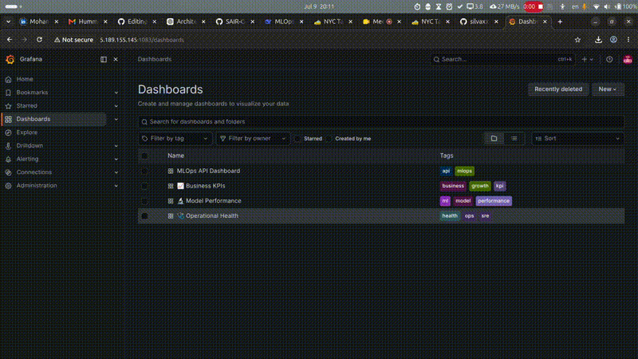
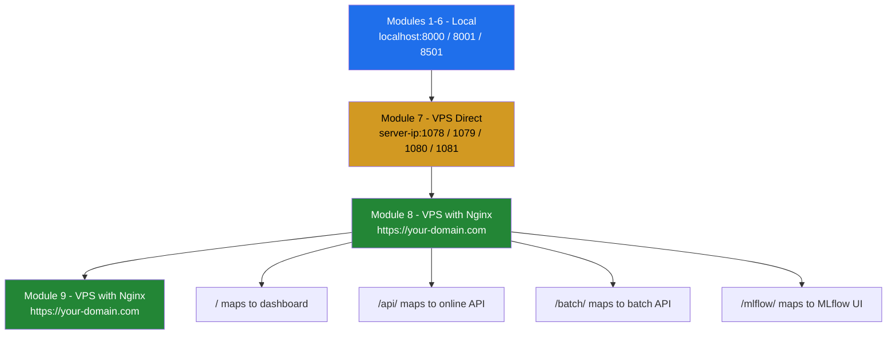
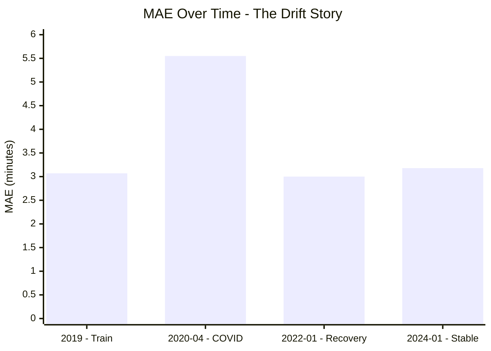
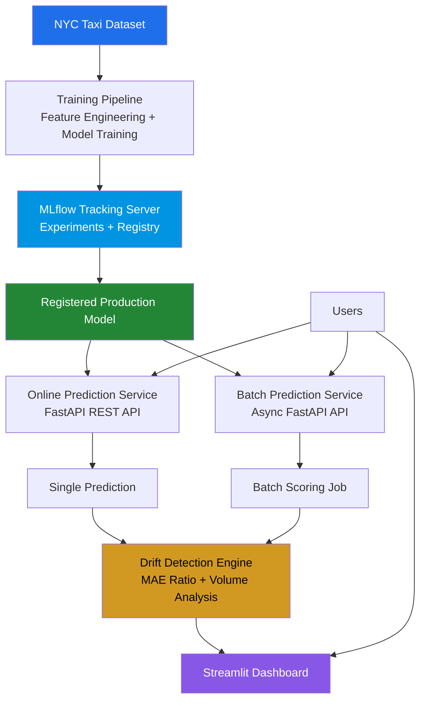
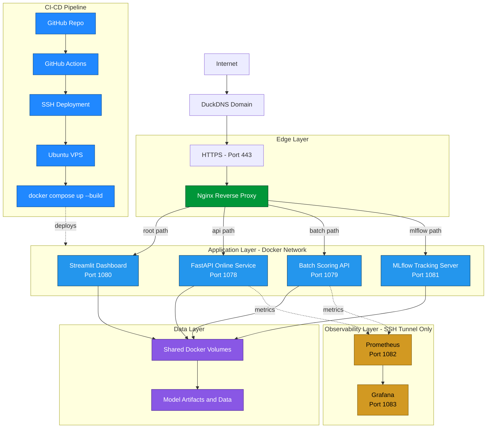
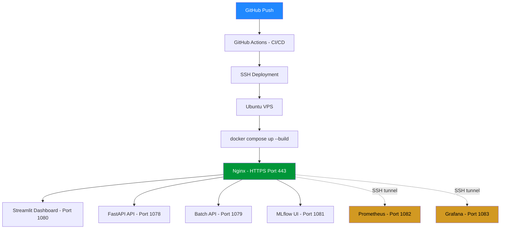

# SAiRCAMP MLOps

**Applied MLOps — A Hands-On, Project-Based Course**


Built around a single real-world problem — **NYC Yellow Taxi trip duration prediction** — developed progressively across 9 modules, from a raw notebook to a live, secured, auto-deploying production system with full observability.

---

## 🎥 Live Demo

**Streamlit Dashboard** — drift reports, prediction volume, and model performance in real time.



**Grafana Monitoring** — operational dashboards for API latency, error rate, and traffic.



---

## 📚 Table of Contents

- [🎥 Live Demo](#-live-demo)
- [🔗 Part of SAiR MLOps Blueprint](#-part-of-sair-mlops-blueprint)
- [🧭 How This Course Works](#-how-this-course-works)
- [🗺️ The Full Arc](#️-the-full-arc)
- [📦 Modules](#-modules)
- [🔀 Why the Ports Change at Module 7](#-why-the-ports-change-at-module-7)
- [🚕 The Dataset](#-the-dataset)
- [📉 The Drift Story](#-the-drift-story)
- [🏛️ System Architecture — Logical View](#️-system-architecture--logical-view)
- [🖥️ Infrastructure / Deployment View](#️-infrastructure--deployment-view)
- [🚀 Quick Start by Module](#-quick-start-by-module)
- [📖 Concept Guides by Module](#-concept-guides-by-module)
- [🎓 Companion Course — DDODS](#-companion-course--ddods)
- [✅ What You Will Have Built by Module 9](#-what-you-will-have-built-by-module-9)
- [📚 Where This Fits in SAIR Jr](#-where-this-fits-in-sair-jr)
- [📄 License](#-license)

---

## 🔗 Part of SAiR MLOps Blueprint

This repo is the **implementation track** of the SAiR MLOps module.

| Resource | Link |
|---|---|
| **Hub Repo** | [SAIR-Org/SAiR-MLOps-Blueprint](https://github.com/SAIR-Org/SAiR-MLOps-Blueprint) |
| **Theory Track** | [MaaS-YT/MLOps-from-the-first-principles](https://github.com/MaaS-YT/MLOps-from-the-first-principles) |
| **YouTube Theory Playlist** | MLOps from First Principles |

> **Use this repo for:** Building the end-to-end production system.
> **Use DDODS for:** Understanding the concepts, mental models, and theory behind MLOps.
>
> 📌 Take both tracks together — watch the theory, then build it live.

---

## 🧭 How This Course Works

Every module builds on the previous one. The codebase grows incrementally.
Each module is **live-coded** — you watch it being built, then run it yourself.

> **One principle: extend, never rewrite.**
> Each module adds exactly one layer on top of what already works.

The system starts as a notebook and ends as a secured, auto-deploying production service with a real domain, HTTPS, CI/CD, and full observability — the same stack used in industry.

---

## 🗺️ The Full Arc

```mermaid
flowchart LR
    M1["Module 1<br/>Model exists"] --> M2["Module 2<br/>+ tracked"]
    M2 --> M3a["Module 3a<br/>+ structured"]
    M3a --> M3b["Module 3b<br/>+ orchestrated"]
    M3b --> M4["Module 4<br/>+ served online"]
    M4 --> M5["Module 5<br/>+ served offline<br/>+ monitored"]
    M5 --> M6["Module 6<br/>+ full integrated<br/>system, local"]
    M6 --> M7["Module 7<br/>+ running on<br/>a real VPS"]
    M7 --> M8["Module 8<br/>+ secured domain<br/>+ CI-CD + HTTPS"]
    M8 --> M9["Module 9<br/>+ monitored and<br/>observable in prod"]

    classDef done fill:#238636,color:#fff,stroke:#0f4b1e
    class M1,M2,M3a,M3b,M4,M5,M6,M7,M8,M9 done
```



---

## 📦 Modules

| # | Folder | What's Built | Key Concepts | Ports | Status |
|---|---|---|---|---|---|
| 1 | `1-intro_and_setup` | Naive → broken → fixed model | EDA, data leakage, sklearn pipelines | — | ✅ |
| 2 | `2-Exp_tracking` | MLflow tracking + model registry | Experiment comparison, runs, aliases | — | ✅ |
| 3a | `pipeline_no_prefect` | Structured pipeline | Clean code, retry logic, separation of concerns | — | ✅ |
| 3b | `pipeline_with_prefect` | Orchestrated pipeline | `@task`/`@flow`, Prefect UI, retries, observability | — | ✅ |
| 4 | `4-Deploy-Online` | Online serving | FastAPI, Docker, MLflow aliases, schema migration | 8000 | ✅ |
| 5 | `5-Deploy-Offline` | Batch scoring + drift monitoring | Async API, drift detection, MAE ratio, Streamlit | 8000, 8001, 8501 | ✅ |
| 6 | `6-Full-System` | Full integrated local system | Docker Compose, service networking, MLflow server | 8000, 8001, 8501 | ✅ |
| 7 | `7-Deployment_test` | Running on a real VPS | SSH, firewall, remote MLflow, SSH tunnel, port mapping | 1078–1081 | ✅ |
| 8 | `8-CI-CD-Ngnix` | Production hardening | Nginx, HTTPS, GitHub Actions, SSL/Certbot | 1078–1081 | ✅ |
| 9 | `9-Monitoring-Observability` | Production observability | Prometheus, Grafana, metrics, alerts, dashboards | 1078–1083 | ✅ |

---

## 🔀 Why the Ports Change at Module 7

Modules 1–6 run locally — default ports work fine with no conflicts.
From Module 7 onward the system runs on a shared VPS alongside other services.
Ports are changed to avoid conflicts, and the system is placed behind Nginx so users only ever see a clean domain URL — not port numbers.



> ⚠️ Prometheus and Grafana are **not** exposed publicly for security reasons. Access them via SSH tunnel.

---

## 🚕 The Dataset

| Modules | Source | Format | Notes |
|---|---|---|---|
| 1–3 | NYC Yellow Taxi, January 2016 | CSV with lat/lon coordinates | Simple starting shape |
| 4–9 | NYC TLC official data, 2019–2024 | Direct parquet download, no credentials needed | Zone IDs instead of lat/lon — a deliberate schema-drift teaching moment |

```
https://d37ci6vzurychx.cloudfront.net/trip-data/yellow_tripdata_{year}-{month:02d}.parquet
```

---

## 📉 The Drift Story

Train on 2019 → deploy → batch score by period → watch what happens:

| Period | Volume | MAE | Note |
|---|---|---|---|
| **2019** | 7.7M trips/month | 3.07 min | ← train here |
| **2020-04** | 204k trips/month | 5.55 min | ← COVID ⚠️ model breaks |
| **2022-01** | 2.3M trips/month | 3.00 min | ← recovery ✅ |
| **2024-01** | 2.7M trips/month | 3.18 min | ← stable ✅ |



Every student lived through 2020. Zero explanation needed.
This is why monitoring exists — without it, the model silently serves 80% worse predictions for months.

---

## 🏛️ System Architecture — Logical View

The architecture diagram describes how the MLOps platform works. It focuses on the logical components, their responsibilities, and how data flows through the system. It intentionally hides infrastructure details such as Docker, VPSs, networking, ports, and HTTPS.



---

## 🖥️ Infrastructure / Deployment View

The infrastructure diagram describes where the system runs. It shows deployment, networking, Docker services, HTTPS, monitoring, and CI/CD.



---

## 🚀 Quick Start by Module

<details>
<summary><strong>Modules 1–3 — Notebooks and pipelines</strong></summary>

```bash
# From repo root
uv sync && source .venv/bin/activate

# Module 1
cd 1-intro_and_setup && jupyter notebook

# Module 2
cd 2-Exp_tracking && jupyter notebook

# Module 3b (orchestrated pipeline)
cd 3-Pipeline_and_Orchestrations/pipeline_with_prefect
prefect server start   # terminal 1
python main.py --sample-size 50000 --no-tune   # terminal 2
```

</details>

<details>
<summary><strong>Modules 4–6 — Local Docker system</strong></summary>

```bash
cd 6-Full-System

# Train first (local)
cd pipeline
python main.py --sample-size 500000 --tune --promote

# Start the full system
cd ..
docker compose up

# Services
# Online API:  http://localhost:8000/docs
# Batch API:   http://localhost:8001/docs
# Dashboard:   http://localhost:8501
```

</details>

<details>
<summary><strong>Module 7 — VPS deployment</strong></summary>

```bash
# On your local machine — open SSH tunnel to remote MLflow
ssh -N -L 1081:localhost:1081 user@your-vps-ip

# Train locally against the remote MLflow
export MLFLOW_TRACKING_URI=http://localhost:1081
cd 7-Deployment_test/pipeline
python main.py --sample-size 500000 --tune --promote

# On the VPS — start the full system
cd ~/Project/7-Deployment_test
docker compose up -d

# Access directly via IP
# http://your-vps-ip:1080     → dashboard
# http://your-vps-ip:1078/docs → online API
# http://your-vps-ip:1079/docs → batch API
# http://your-vps-ip:1081      → MLflow UI
```

</details>

<details>
<summary><strong>Module 8 — Production (Nginx + HTTPS + CI/CD)</strong></summary>

```bash
# On the VPS
cd ~/Project/8-CI-CD-Ngnix
docker compose up -d

# Access via domain (HTTPS)
# https://your-domain.com/            → dashboard
# https://your-domain.com/api/docs    → online API
# https://your-domain.com/batch/docs  → batch API
# https://your-domain.com/mlflow/     → MLflow UI

# CI/CD — push to main = auto-deploy
git push origin main
```

</details>

<details>
<summary><strong>Module 9 — Production Observability (Prometheus + Grafana)</strong></summary>

```bash
# On the VPS
cd ~/Project/9-Monitoring-Observability
docker compose up -d

# Access via domain (HTTPS)
# https://your-domain.com/            → dashboard
# https://your-domain.com/api/docs    → online API
# https://your-domain.com/batch/docs  → batch API
# https://your-domain.com/mlflow/     → MLflow UI

# Access monitoring via SSH tunnel
ssh -L 9090:localhost:1082 -L 3000:localhost:1083 user@vps-ip
# http://localhost:9090 → Prometheus
# http://localhost:3000 → Grafana

# CI/CD — push to main = auto-deploy
git push origin main
```

</details>

---

## 📖 Concept Guides by Module

| Module | Guide | Concept |
|---|---|---|
| 2 | `MLFLOW_QUICKSTART.md` | Experiment tracking, runs, registry, aliases |
| 3b | `PREFECT_QUICKSTART.md` | Orchestration, `@task`/`@flow`, retries, states |
| 4 | `FASTAPI.md` | Online serving, lifespan, Pydantic, health checks |
| 4 | `DOCKER_FOR_ML.md` | Images, containers, volumes, bind mounts |
| 4 | `MLFLOW_REGISTRY.md` | Registry vs tracking, preprocessor artifact, shared code |
| 5 | `BATCH_DEPLOYMENT.md` | Batch vs online, async API, two-output design |
| 5 | `DRIFT_DETECTION.md` | MAE ratio, volume signal, why σ formula fails |
| 6 | `SYSTEM_INTEGRATION.md` | Docker networking, shared state, startup order |
| 6 | `MLFLOW_SERVER.md` | Why SQLite broke in Docker, tracking server solution |
| 6 | `MLOPS_LIFECYCLE.md` | Full picture — where every tool fits |
| 7 | `README.md` | VPS setup, SSH tunnel, remote MLflow, port strategy |
| 8 | `ngnix.md` | Reverse proxy, WebSocket, 127.0.0.1 vs localhost, 308 vs 301 |
| 8 | `SSL.md` | Certbot, Let's Encrypt, HTTP→HTTPS, the 308 trap |
| 8 | `CICD.md` | GitHub Actions, SSH deploy, secrets, runner lifecycle |
| 9 | `MONITORING_CONCEPTS.md` | Mental model — what monitoring is and why |
| 9 | `PROMETHEUS_GRAFANA.md` | Prometheus + Grafana setup and usage |
| 9 | `EVIDENTLY_DRIFT.md` | Evidently drift detection concepts |
| 9 | `METRICS_REFERENCE.md` | All metrics and alert thresholds |

---

## 🎓 Companion Course — MLOps from First Principles

SAiRCAMP MLOps runs in parallel with (*MLOps from First Principles*).

| DDODS (Theory) | SAiRCAMP MLOps (Implementation) |
|---|---|
| Concept-first, broad coverage | Project-first, production depth |
| Simple focused demos | One real dataset (1M+ rows) |
| Each tool explained in isolation | Tools layered onto a growing system |
| Theory of why things work | Reality of what breaks in production |

> Use **DDODS** to understand the concepts deeply.
> Use **SAiRCAMP MLOps** to build something real with them.

---

## ✅ What You Will Have Built by Module 9

A secured, auto-deploying production MLOps system with full observability:



Trained on 2019 NYC taxi data. Serving real predictions. Detecting drift.
Reachable from anywhere in the world at `https://your-domain.com`.

---

## 📚 Where This Fits in SAIR Jr.

| Module | Name | Status | Repo |
|---|---|---|---|
| 4 | Applied Deep Learning | ✅ | [github.com/SAIR-Org/SAIR_Jr](https://github.com/SAIR-Org/SAIR_Jr) |
| 5 | GPT from Scratch | ✅ | [github.com/SAIR-Org/SAIR_Jr](https://github.com/SAIR-Org/SAIR_Jr) |
| 6 | **MLOps ← you are here** | 🔄 | [github.com/SAIR-Org/SAiR-MLOps-Blueprint](https://github.com/SAIR-Org/SAiR-MLOps-Blueprint) |
| — | ↳ DDODS (theory, standalone repo) | | |
| — | ↳ SAIRCAMP (live builds, standalone repo) **← YOU ARE HERE** | | |
| Capstone | Real-World Impact Project | | [github.com/SAIR-Org/SAIR_Jr](https://github.com/SAIR-Org/SAIR_Jr) |

---

## 📄 License

This project is for **educational purposes**. All content is provided as a companion resource to the live cohort sessions.